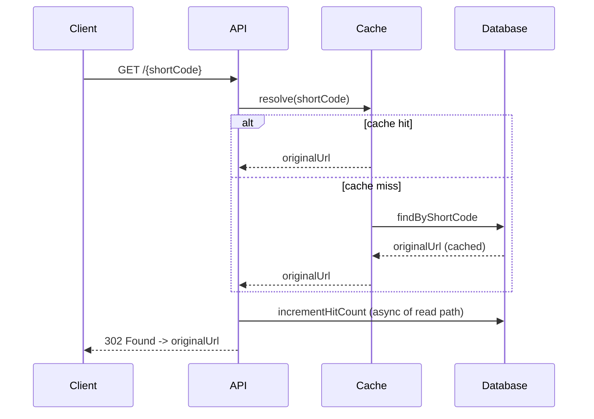

# URL Shortener API

[](https://github.com/AfranUsmani/url-shortener-api/actions/workflows/ci.yml)


A production-grade URL shortener REST API built with **Java 21 + Spring Boot 3**. It turns long URLs into compact short codes, resolves them with a **cache-aside** read path for low-latency redirects, and ships with **Prometheus metrics**, **OpenAPI docs**, containerization, and a CI pipeline.

> Designed as a compact but realistic backend service — clean layering, deterministic short-code generation, caching, observability, and tests — the kind of concerns that show up in real systems, not a tutorial CRUD app.

---

## ✨ Features

- **REST API** to create short links and fetch per-link hit statistics.
- **Collision-free short codes** via Base62 encoding of the database id — no retry loops, no coordination.
- **Cache-aside reads**: hot short codes are served from cache (Redis in prod, in-memory locally), so redirects don't hit the database on every request.
- **Atomic hit counting** through a single `UPDATE` statement — no read-modify-write race.
- **Consistent error contract** — every failure returns the same JSON `ApiError` shape.
- **Observability out of the box** — Spring Boot Actuator health checks + a `/actuator/prometheus` scrape endpoint (Micrometer).
- **Interactive API docs** via Swagger UI (springdoc-openapi).
- **Runs with zero infrastructure locally** (H2 + in-memory cache) and a **production-like Docker Compose** stack (PostgreSQL + Redis).
- **Tested** — unit tests for the encoder and service, plus a full-context integration test covering the create → redirect → stats flow.

---

## 🏗️ Architecture

```mermaid
flowchart LR
    Client -->|POST /api/v1/urls| API[Spring Boot API]
    Client -->|GET /{code}| API
    API --> Service[UrlService]
    Service -->|cache-aside| Cache[(Redis / in-memory)]
    Service -->|miss| DB[(PostgreSQL / H2)]
    API -.->|/actuator/prometheus| Prometheus[(Prometheus)]
```

**Request flow for a redirect:**



---

## 🧰 Tech Stack

| Concern         | Technology                                   |
| --------------- | -------------------------------------------- |
| Language        | Java 21                                      |
| Framework       | Spring Boot 3.3 (Web, Data JPA, Cache)       |
| Database        | PostgreSQL (prod) · H2 (local/tests)         |
| Cache           | Redis (prod) · in-memory (local)             |
| Observability   | Spring Boot Actuator · Micrometer · Prometheus |
| API Docs        | springdoc-openapi (Swagger UI)               |
| Build           | Maven                                        |
| Containerization| Docker · Docker Compose                      |
| CI              | GitHub Actions                               |

---

## 🚀 Quick Start

### Option A — Run locally (no database or Redis required)

```bash
mvn spring-boot:run
```

The app starts on `http://localhost:8080` using in-memory H2 and an in-memory cache.

### Option B — Production-like stack (PostgreSQL + Redis)

```bash
docker compose up --build
```

This starts the API, PostgreSQL, and Redis together with health checks.

---

## 📡 API Reference

### Create a short link

```bash
curl -X POST http://localhost:8080/api/v1/urls \
  -H "Content-Type: application/json" \
  -d '{"url":"https://spring.io/projects/spring-boot"}'
```

```json
{
  "shortCode": "1",
  "shortUrl": "http://localhost:8080/1",
  "originalUrl": "https://spring.io/projects/spring-boot",
  "hitCount": 0,
  "createdAt": "2026-07-22T10:15:30Z"
}
```

> Short codes are the Base62 encoding of the row id, so they stay compact and grow
> gracefully (`1`, `2`, … `10`, … `2Bi`) as more links are created.

### Resolve (redirect)

```bash
curl -v http://localhost:8080/1
# -> HTTP/1.1 302 Found
# -> Location: https://spring.io/projects/spring-boot
```

### Fetch statistics

```bash
curl http://localhost:8080/api/v1/urls/1
```

| Method | Path                     | Description                          |
| ------ | ------------------------ | ------------------------------------ |
| POST   | `/api/v1/urls`           | Create a short link                  |
| GET    | `/api/v1/urls/{code}`    | Get link metadata + hit count        |
| GET    | `/{code}`                | Redirect (302) to the original URL   |

**Interactive docs:** `http://localhost:8080/swagger-ui.html`

---

## 📊 Observability

| Endpoint                   | Purpose                          |
| -------------------------- | -------------------------------- |
| `/actuator/health`         | Liveness/readiness + dependencies|
| `/actuator/metrics`        | Micrometer metrics               |
| `/actuator/prometheus`     | Prometheus scrape endpoint       |

---

## 🧪 Testing

```bash
mvn verify
```

Runs the unit tests (`Base62EncoderTest`, `UrlServiceTest`) and the full-context
integration test (`UrlControllerIT`) against H2.

---

## 📁 Project Structure

```
src/main/java/io/github/afranusmani/urlshortener
├── controller   # REST + redirect endpoints
├── service      # business logic, Base62 encoding, caching
├── repository   # Spring Data JPA repository
├── model        # JPA entity
├── dto          # request/response records
├── exception    # global handler + error contract
└── config       # OpenAPI configuration
```

---

## 🗺️ Roadmap

- [ ] Custom / vanity short codes
- [ ] Link expiration (TTL) and soft deletion
- [ ] Per-client rate limiting (Bucket4j)
- [ ] Testcontainers-based integration tests against real Postgres + Redis

---

## 👤 Author

**Afran Usmani** — Backend Software Engineer
[GitHub](https://github.com/AfranUsmani) · [LinkedIn](https://www.linkedin.com/in/afran-usmani/)

Licensed under the [MIT License](LICENSE).
