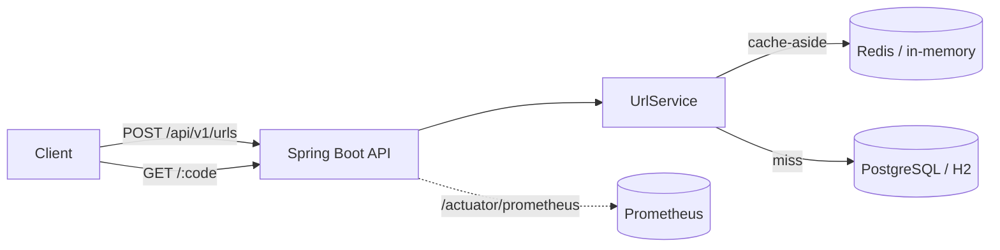
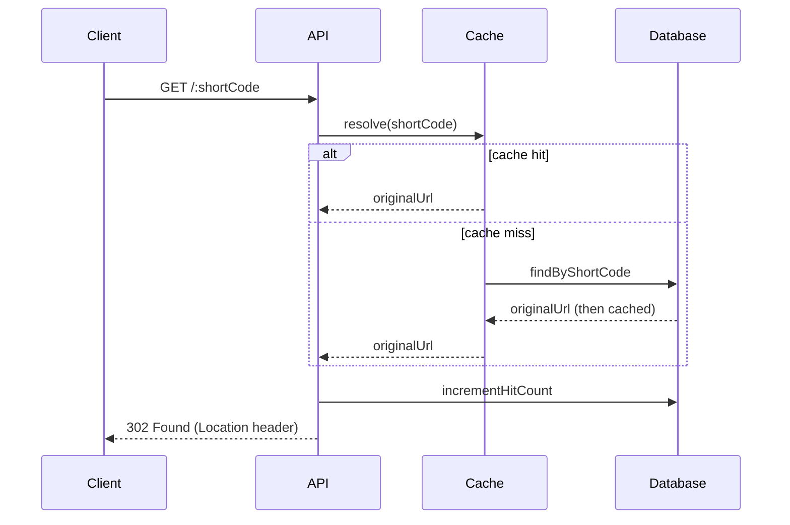

# URL Shortener API

[](https://github.com/AfranUsmani/url-shortener-api/actions/workflows/ci.yml)


A production-grade URL shortener REST API built with **Java 21 + Spring Boot 3**. It turns long URLs into compact short codes, resolves them with a **cache-aside** read path for low-latency redirects, and ships with **Prometheus metrics**, **OpenAPI docs**, containerization, and a CI pipeline.

> Designed as a compact but realistic backend service — clean layering, deterministic short-code generation, caching, observability, and tests — the kind of concerns that show up in real systems, not a tutorial CRUD app.

---

## 🌐 Live Demo

- **Dashboard (start here):** https://url-shortener-api-1716.onrender.com/
- **Swagger UI (for developers):** https://url-shortener-api-1716.onrender.com/swagger-ui.html
- **API base:** `https://url-shortener-api-1716.onrender.com/api/v1/urls`
- **Health:** https://url-shortener-api-1716.onrender.com/actuator/health

The root URL now serves a lightweight **web dashboard** — anyone can shorten a link,
click it, and watch the click count update live, without touching Swagger or curl.

```bash
curl -X POST https://url-shortener-api-1716.onrender.com/api/v1/urls \
  -H "Content-Type: application/json" \
  -d '{"url":"https://spring.io/projects/spring-boot"}'
```

> ⏳ Hosted on a free tier that sleeps when idle — the **first request after inactivity may take ~30–60s** to wake the instance, then it's fast. Demo data is stored in-memory (H2) and resets on restart.

---

## 🖥️ Dashboard

Served at the root path (`/`) as a zero-build, dependency-free single page
(`src/main/resources/static/`). It's the non-technical front door to the same API
that Swagger documents:

- **Shorten** a URL — optionally with a **custom alias** and an **expiry** — and get a
  copy-ready short link plus a **QR code** (view/download) with one click.
- **Your links** table — every link you create is remembered in the browser
  (`localStorage`) and its click count is refreshed from `GET /api/v1/urls/{code}`.
- **Analytics modal** — a per-link breakdown of devices, browsers, referrer sources and a
  daily clicks time series, rendered from `/api/v1/urls/{code}/analytics` (no chart library).
- **Live stats** — links created, total clicks, and the most-clicked link.
- **Health pill** — polls `/actuator/health` and shows the API status at a glance.
- Handles the free-tier **cold start** gracefully (loading state + a heads-up note),
  flags expired links, and prunes links the server no longer knows about after a restart.

Because the page is served by the app itself, all calls are same-origin — no CORS,
no separate frontend deployment.

---

## 📸 Screenshots

The dashboard lives at [`/`](https://url-shortener-api-1716.onrender.com/); interactive API docs live at [`/swagger-ui.html`](https://url-shortener-api-1716.onrender.com/swagger-ui.html).

<!-- Generate these two assets with the guide in docs/README.md, then uncomment:


-->

---

## ✨ Features

- **REST API** to create short links and fetch per-link hit statistics.
- **Collision-free short codes** via Base62 encoding of the database id — no retry loops, no coordination.
- **Custom / vanity aliases** — bring your own code (`/launch-2026`); availability is checked up front (409 on clash) and backed by a unique index against races.
- **Link expiration (TTL)** — optional expiry; expired links return **410 Gone** and stop redirecting.
- **QR codes** — a per-link PNG endpoint (`/api/v1/urls/{code}/qr`), rendered server-side with ZXing.
- **Async click analytics** — every redirect is captured off the hot path (referrer host, device, browser, daily time series) and exposed via `/api/v1/urls/{code}/analytics`; the redirect itself only does an atomic counter bump.
- **Cache-aside reads**: hot short codes are served from cache (Redis in prod, in-memory locally), so redirects don't hit the database on every request.
- **Atomic hit counting** through a single `UPDATE` statement — no read-modify-write race.
- **Consistent error contract** — every failure returns the same JSON `ApiError` shape.
- **Observability out of the box** — Spring Boot Actuator health checks + a `/actuator/prometheus` scrape endpoint (Micrometer).
- **Web dashboard** served at `/` — shorten links (with alias/expiry), show QR codes, and explore click analytics without touching Swagger or curl.
- **Interactive API docs** via Swagger UI (springdoc-openapi).
- **Runs with zero infrastructure locally** (H2 + in-memory cache) and a **production-like Docker Compose** stack (PostgreSQL + Redis).
- **Tested** — unit tests for the encoder, UA classifier and service, plus full-context integration tests covering create → redirect → stats, aliases, expiry, QR, and async analytics.

---

## 🏗️ Architecture



**Request flow for a redirect:**



---

## 🧰 Tech Stack

| Concern         | Technology                                   |
| --------------- | -------------------------------------------- |
| Language        | Java 21                                      |
| Framework       | Spring Boot 3.3 (Web, Data JPA, Cache)       |
| Database        | PostgreSQL (prod) · H2 (local/tests)         |
| Cache           | Redis (prod) · in-memory (local)             |
| Observability   | Spring Boot Actuator · Micrometer · Prometheus |
| API Docs        | springdoc-openapi (Swagger UI)               |
| Build           | Maven                                        |
| Containerization| Docker · Docker Compose                      |
| CI              | GitHub Actions                               |

---

## 🚀 Quick Start

### Option A — Run locally (no database or Redis required)

```bash
mvn spring-boot:run
```

The app starts on `http://localhost:8080` using in-memory H2 and an in-memory cache.

### Option B — Production-like stack (PostgreSQL + Redis)

```bash
docker compose up --build
```

This starts the API, PostgreSQL, and Redis together with health checks.

---

## 📡 API Reference

### Create a short link

```bash
curl -X POST http://localhost:8080/api/v1/urls \
  -H "Content-Type: application/json" \
  -d '{"url":"https://spring.io/projects/spring-boot"}'
```

```json
{
  "shortCode": "1",
  "shortUrl": "http://localhost:8080/1",
  "originalUrl": "https://spring.io/projects/spring-boot",
  "hitCount": 0,
  "createdAt": "2026-07-22T10:15:30Z",
  "expiresAt": null,
  "expired": false,
  "qrCodeUrl": "http://localhost:8080/api/v1/urls/1/qr"
}
```

> Short codes are the Base62 encoding of the row id, so they stay compact and grow
> gracefully (`1`, `2`, … `10`, … `2Bi`) as more links are created.

**With a custom alias and expiry** (both optional):

```bash
curl -X POST http://localhost:8080/api/v1/urls \
  -H "Content-Type: application/json" \
  -d '{"url":"https://spring.io","customAlias":"spring","expiresAt":"2026-12-31T23:59:59Z"}'
# -> 201 Created, shortCode "spring"
# a taken alias -> 409 Conflict; an expiresAt in the past -> 400 Bad Request
```

### Resolve (redirect)

```bash
curl -v http://localhost:8080/spring
# -> HTTP/1.1 302 Found
# -> Location: https://spring.io
# an expired link -> HTTP/1.1 410 Gone
```

### QR code &amp; analytics

```bash
curl http://localhost:8080/api/v1/urls/spring/qr --output spring.png   # PNG image
curl http://localhost:8080/api/v1/urls/spring/analytics                # JSON breakdown
```

| Method | Path                              | Description                                        |
| ------ | --------------------------------- | -------------------------------------------------- |
| POST   | `/api/v1/urls`                    | Create a short link (optional `customAlias`, `expiresAt`) |
| GET    | `/api/v1/urls/{code}`             | Get link metadata + hit count                      |
| GET    | `/api/v1/urls/{code}/qr`          | QR code PNG for the short link (`?size=` optional) |
| GET    | `/api/v1/urls/{code}/analytics`   | Aggregated clicks by device / browser / referrer / day |
| GET    | `/{code}`                         | Redirect (302), or 410 Gone if expired             |

**Interactive docs:** `http://localhost:8080/swagger-ui.html`

---

## 📊 Observability

| Endpoint                   | Purpose                          |
| -------------------------- | -------------------------------- |
| `/actuator/health`         | Liveness/readiness + dependencies|
| `/actuator/metrics`        | Micrometer metrics               |
| `/actuator/prometheus`     | Prometheus scrape endpoint       |

---

## 🧪 Testing

```bash
mvn verify
```

Runs the unit tests (`Base62Test`, `UserAgentsTest`, `UrlServiceTest`, `UrlMappingTest`) and
the full-context integration tests (`UrlControllerIT`) against H2 — covering create → redirect →
stats, custom aliases (409), expiry (410), the QR endpoint, and async analytics.

---

## 📁 Project Structure

```
src/main/java/io/github/afranusmani/urlshortener
├── controller   # REST + redirect + QR/analytics endpoints
├── service      # business logic: Base62, caching, QR (ZXing), async analytics, UA parsing
├── repository   # Spring Data JPA repositories (url mapping + click events)
├── model        # JPA entities (UrlMapping, ClickEvent)
├── dto          # request/response records (incl. AnalyticsResponse)
├── exception    # global handler + error contract (404 / 409 / 410 / 400)
└── config       # OpenAPI + async executor configuration

src/main/resources/static   # web dashboard (index.html · styles.css · app.js)
```

---

## 🗺️ Roadmap

- [x] Custom / vanity short codes
- [x] Link expiration (TTL) — 410 Gone on expired links
- [x] QR codes per short link
- [x] Click analytics (device / browser / referrer / daily), captured asynchronously
- [ ] Soft deletion of links
- [ ] Per-client rate limiting (Bucket4j)
- [ ] Geo/IP enrichment for analytics (currently privacy-friendly: no IP stored)
- [ ] Testcontainers-based integration tests against real Postgres + Redis

---

## 📖 Deep dive

Design decisions and the two bugs I caught only by running the service end-to-end:
[**docs/writeup.md**](docs/writeup.md).

---

## 👤 Author

**Afran Usmani** — Backend Software Engineer
[GitHub](https://github.com/AfranUsmani) · [LinkedIn](https://www.linkedin.com/in/afran-usmani/)

Licensed under the [MIT License](LICENSE).
